# LibreSDRとそのパチモノHamGeek AD9363

HamGeek AD9363をアリエクで購入。board rev. 5.とのこと。

## セットアップ

SDカードはついてこないので、32GBのカードにtezuka firmwareを焼く。  
とりあえずv0.3.21のLibreSDR用を焼いたら動いた。

https://github.com/F5OEO/tezuka_fw

DEBUG側のUSB-CをPCに接続すると、シリアルポートが4つ出現する。3番目(port C)がLinuxに入れる当たりポート。ボーレートは115200。
何かの役に立ちそうなのでLinuxのブートログを置いておく。[petalinux_bootlog.txt](petalinux_bootlog.txt)

root/analogでログインする。USB接続じゃなくてEther接続で使いたいのでIPアドレスを確認すると、usb0に192.168.2.1/24が割り当てられている。宅内LANとSubnetがかぶっているので使えない。

usb0には192.168.3.2/24 を割り当てて回避。eth0はDHCPでアドレス拾えている。Static IPを割り当てるべきなんだろうかとりあえずこれでいく。

```bash
# ip addr
1: lo: <LOOPBACK,UP,LOWER_UP> mtu 65536 qdisc noqueue state UNKNOWN group default qlen 1000
    link/loopback 00:00:00:00:00:00 brd 00:00:00:00:00:00
    inet 127.0.0.1/8 scope host lo
       valid_lft forever preferred_lft forever
2: eth0: <BROADCAST,MULTICAST,UP,LOWER_UP> mtu 1500 qdisc fq state UP group default qlen 1000
    link/ether 00:60:88:ec:01:7b brd ff:ff:ff:ff:ff:ff permaddr 7e:60:15:36:94:e8
    inet 192.168.2.131/24 brd 192.168.2.255 scope global eth0
       valid_lft forever preferred_lft forever
3: sit0@NONE: <NOARP> mtu 1480 qdisc noop state DOWN group default qlen 1000
    link/sit 0.0.0.0 brd 0.0.0.0
4: usb0: <NO-CARRIER,BROADCAST,MULTICAST,UP> mtu 1500 qdisc pfifo_fast state DOWN group default qlen 1000
    link/ether 00:05:f7:0b:9a:75 brd ff:ff:ff:ff:ff:ff
    inet 192.168.3.2/24 scope global usb0
       valid_lft forever preferred_lft forever
5: gse0: <POINTOPOINT,MULTICAST,NOARP,UP,LOWER_UP> mtu 1500 qdisc fq state UNKNOWN group default qlen 500
    link/none
    inet 44.0.0.2/32 scope global gse0
       valid_lft forever preferred_lft forever
```

これでWebブラウザから管理画面に入れるようになった。
組み込みpetalinuxなので今やったIPアドレス設定は再起動で消えてしまうので、Web管理画面からPersistent設定のipaddrを設定する。この設定はSPI-Flashに書かれる模様。 

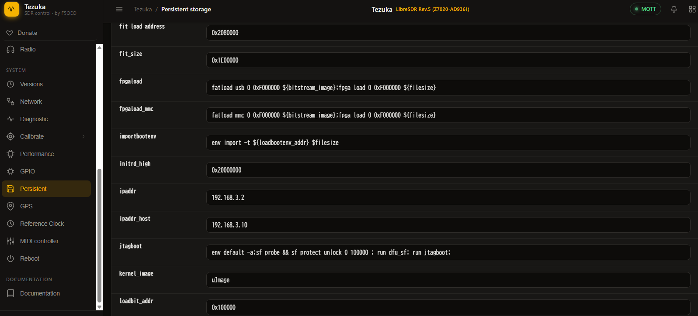

### libiioを入れる

Pluto SDR公式手順で入れるのが正解な模様。

https://analogdevicesinc.github.io/system-level/tools/pluto-m2k/drivers/#pluto-m2k-drivers-windows

~~IQ転送にはlibiioを使っているので、Windows用クライアントツールが必要なんだが、入れ方の正解がわからない。↓のWindows用バイナリを展開してパスを通せばよさそうなんだが、コレジャナイ感がする。~~

https://github.com/analogdevicesinc/libiio

~~ADI ACEを入れると必要そうなものは一式入る。libiio関連バイナリがc:\Windows\system32\ にブチ込まれるぞ。~~

https://www.analog.com/jp/resources/evaluation-hardware-and-software/evaluation-development-platforms/ace-software.html

コマンドプロンプトでiio_info実行してデバイス情報取れればOK. [iio_info.txt](./iio_info.txt)

```bash
iio_info.exe -u ip:192.168.2.131
```
### ADI IIO Oscilloscopeを使ってみる。

とりあえず波形を見る。接続情報いれて、接続。

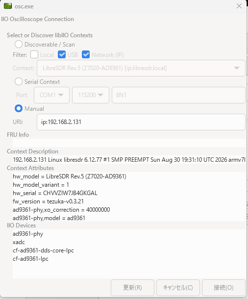

ここで周波数等いろいろ設定できるようで。
しかしch2側の設定がない。ADI謹製だからか？(本家Pluto SDRは1Rx1Tx)


ちなみにAD936X Advancedタブはこんな感じ。本業でもおなじみなQEC Trackingが何とかかんとか。
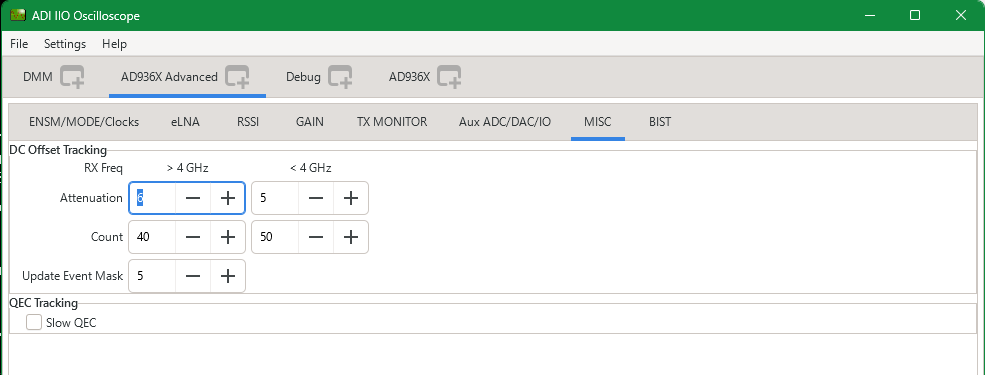

SMAケーブルでTX1 port ---> RX1 portに折り返して信号見れる。
Zero-IFなので帯域センター周波数では送信も受信もできない。なのでDDSで500KHzオフセットしたCWを吹かせる。

File---> New plotでお城画面が開く。Captureすると、それっぽい波形が出た。
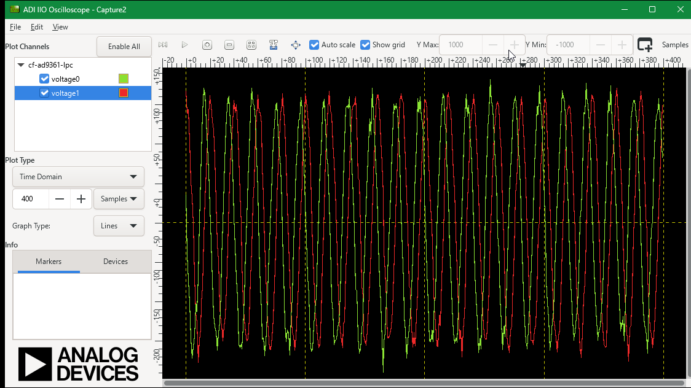

FFTでも見てみる。ちゃんと+500KHzにピークが立っている。
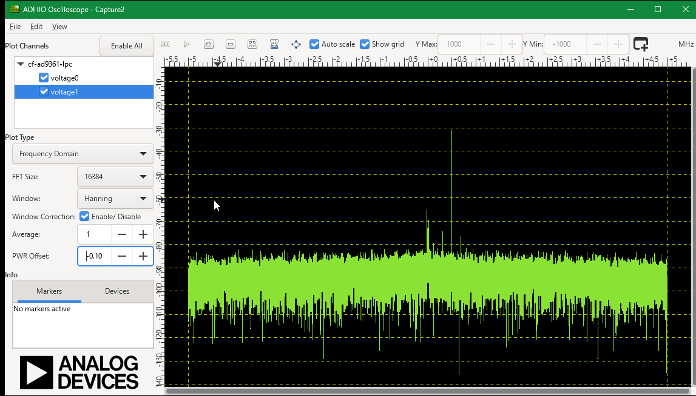

## IQキャプチャしてみる

宅内WiFi 2.4GHzをIQキャプチャする。管理WebのSpectrogramで様子を見る。
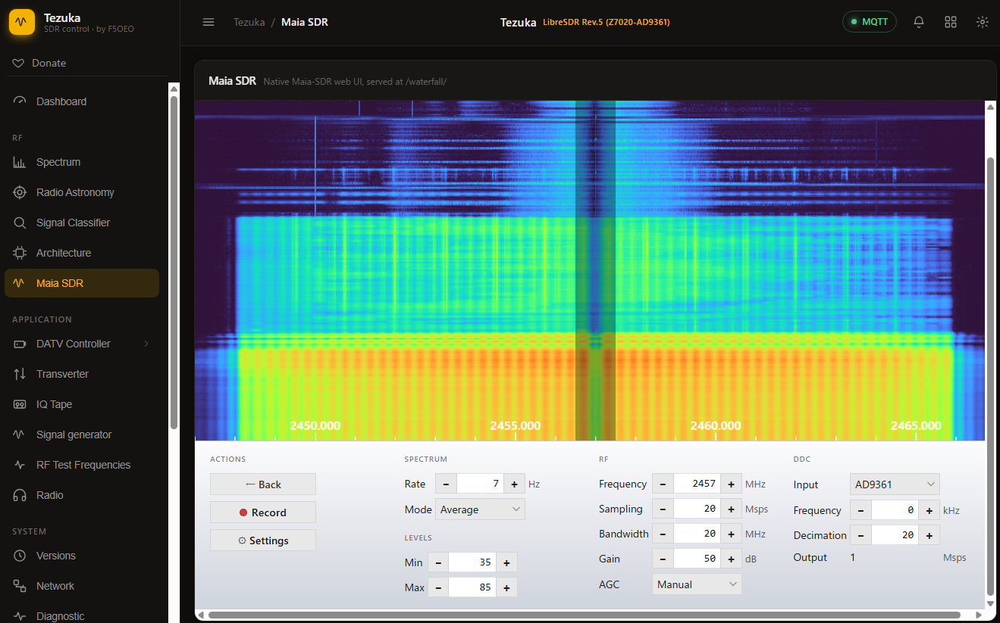

周波数やGain設定はMaia SDR側で設定する。CLIでもできるが、IIOが難解すぎてやりたくない。

この状態から、↓のコマンドでIQキャプチャできる。
```bash
iio_readdev -u ip:192.168.2.131 -b 2000000 -s 2000000 cf-ad9361-lpc 1>.\iqcap20Msps.raw
```

-s はサンプル数。-b はiioバッファサイズなのだが詳細不明。

あまり大きい値を指定するとlinux UARTにエラーが出る。
```bash
cma: __cma_alloc: reserved: alloc failed, req-size: 3907 pages, ret: -12
cma: number of available pages: 187@69+189@4163+189@8259+4029@12355=> 4594 free of 16384 total pages
```

とりあえずそれっぽい波形は取れたが若干怪しい。 [WiFi24G_100ms20Msps16bit.raw](./WiFi24G_100ms20Msps16bit.raw)

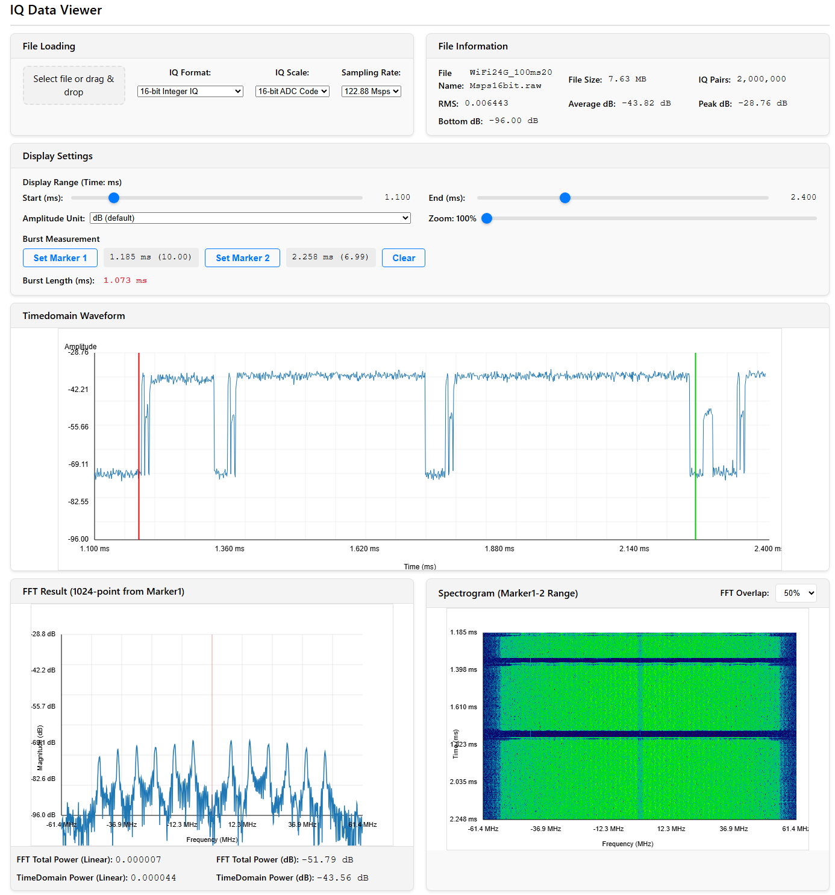

## 解析

ADIのデータシートより https://www.analog.com/media/en/technical-documentation/data-sheets/ad9361.pdf

2RX+2TX構成だが、LOはTX/RXでそれぞれ1個しかない。いわゆるFDD 2x2MIMO構成。
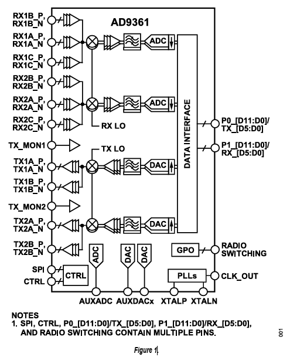

なんだが、IIO Oscilloscopeに出てくる図のほうがわかりやすい。
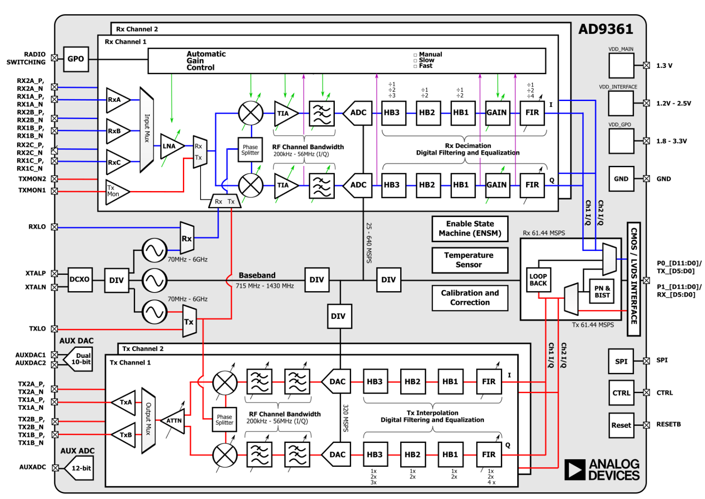

ADIのUser Guideより https://www.analog.com/media/en/technical-documentation/user-guides/ad9361.pdf

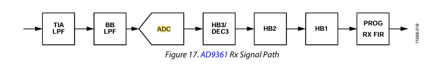
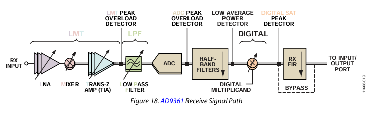

iio_infoの出力をまとめるとこうなる。
```
IIO context
├── device0: ad9361-phy  主にAnalogまわりの設定
│   ├── voltage0:  (input)  受信GainとかRF BW,サンプリング周波数とか
│   ├── voltage0:  (output) 送信GainとかRF BW.サンプリング周波数とか
│   ├── voltage2:  (input)  なんか変 謎
│   ├── voltage2:  (output) なんか変 謎
│   ├── voltage3:  (output) 謎
│   ├── altvoltage0: RX_LO (output)  受信周波数関連
│   ├── altvoltage1: TX_LO (output)  送信周波数関連
│   ├── temp0:  (input)  温度モニタぽい
│   ├── out:  (input, WARN:iio_channel_get_type()=UNKNOWN) 謎
├── device1: xadc  vccoddrとか電圧モニタ関連なので省略
├── device2: cf-ad9361-dds-core-lpc (buffer capable) Tx Baseband関連
│   ├── voltage0:  (output, index: 0, format: le:S16/16>>0) TX1のBB
│   ├── voltage1:  (output, index: 1, format: le:S16/16>>0) TX2のBB
│   ├── altvoltage0: TX1_I_F1 (output)  この辺の設定でVCW出せる模様
│   ├── altvoltage1: TX1_I_F2 (output)
│   ├── altvoltage2: TX1_Q_F1 (output)
│   ├── altvoltage3: TX1_Q_F2 (output)
├── device3: cf-ad9361-lpc (buffer capable)  Rx Baseband関連
│   ├── voltage0:  (input, index: 0, format: le:S12/16>>0) RX1 BB
│   ├── voltage1:  (input, index: 1, format: le:S12/16>>0) RX2 BB
```